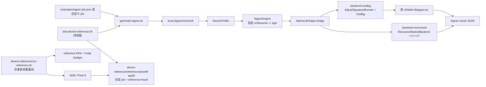

# QBDI Signer 工程地图与维护说明

> 本文按当前 `/Users/sanbo/Desktop/api/qbdi` 工作树编写。它回答两件事：
>
> 1. 每个根目录/根脚本的用途、是否属于正常桌面 signer、如何实现；
> 2. `device-reference` 是否被调用，以及它与无需真机的严格回归之间的关系。
>
> **结论先行：**日常签名和 `test-device-reference.sh` 的严格比较都在电脑上运行，
> **不会调用** `device-reference/run-reference.sh`、ADB、Frida 或真机。`device-reference`
> 仅在需要重新采集/更新一个真机基线时才需要真实 Android 设备。

### 2026-07-12 当前工作树审计记录

本结论不是仅按目录名推断，而是同时核对了入口脚本和实际运行结果：

| 核对项 | 证据 | 当前结果 |
| --- | --- | --- |
| 普通 JSON signer | `generate-signer.sh` 只构建 Maven 模块并启动 `local.SignerOneClick` | `./generate-signer.sh examples/signer-job.json` 成功，产生 176-byte raw signature。 |
| 原 API 与原 JAR 隔离 | `test-api-contract.sh` 用 `javap` 比较原 `classes.jar` 与本项目的 `Signer` descriptor，并拒绝原 JAR 混入 runtime classpath | 通过：`API contract and runtime independence OK`。 |
| 严格测试读取什么 | `test-device-reference.sh` 的唯一 `device-reference` 路径是 `references/pixel8-api36`；job 内的 `expectedResultFile` 由 `SignerOneClick` 递归严格比较 | 不会执行 `run-reference.sh`，只读取冻结 fixture。 |
| 真机工具实际做什么 | `device-reference/run-reference.sh` 明确执行 `adb install`、`adb shell`、`adb forward`、`frida-ps`、`frida` | 它是重采集工具，不能成为无手机 signer 的依赖。 |
| Pixel 8 strict 状态 | `./test-device-reference.sh` 在 host 上运行；`SignerOneClick.firstMismatch` 递归比较完整结构化 JSON | **通过**：176-byte raw signature、Base64、metadata 和 output 与冻结 reference 全部一致。 |
| Native 完整算法 | 独立 C++ 实现 IV、动态 field 0、custom-state field 4、动态 payload、AES-CBC、HMAC 和结果拼装 | frozen Pixel、176-byte 变体、9-correction/192-byte 与 17-correction/208-byte 动态扩容，共十三组完整原 SO oracle 均逐字节一致。 |
| Java recovered backend | `NativeLibHelper -> RecoveredNativeBackend -> recovered-primitives` | 不加载原 SO/Unidbg；冻结 Pixel 完整 JSON 严格一致。 |
| Native codeword 边界 | 初始化/cmdline/路径/API/certificate/trampoline/timing 与原 SO correction 注入 | 已闭合事件语义和顺序；field 0 容量按 `8→16→24→32...` 分块扩容，17 corrections 的 208-byte 原 SO oracle 已闭合。 |
| Metadata/算法选择 | `0x9954c` builder trace、四组静态编码地址、27-case 参数矩阵 | 当前 3.67.0 所有有效可达路径均为 `adj8`；已证明 API-selected key-management，不把它误报成第二套 final envelope。 |

审计时实际通过了 Maven 全量 **64 tests**（0 failure/error/skip）与打包、API descriptor、one-click 两次确定性、
外部结构化 Java API、三 JVM 进程隔离和历史 Python wrapper contract。随后单独执行
`./test-device-reference.sh`，它在完全没有 ADB/Frida/真机参与的情况下退出 `0`，
并报告 `Pixel 8 device reference exact structured JSON match OK`。这里的「不调用」仅指
**普通桌面运行**与**冻结 reference 的 host strict test**；维护者手动执行
`run-reference.sh` 时当然会使用真机工具。

---

## 1. 四条运行路径



### A. 普通桌面签名：推荐入口

```bash
cd /Users/sanbo/Desktop/api/qbdi
./generate-signer.sh examples/signer-job.json
```

`generate-signer.sh` 用 Maven 构建 `unidbg-adjust-runner`，随后运行
`local.SignerOneClick`。后者解析 JSON、构造 `DeviceProfile`、创建
`SignerEngine`，由 `SignerEngine` 固定先执行 `Signer.onResume()`，再执行
`Signer.sign(...)`。Native 调用由 Java bridge 转入 Unidbg，加载的仍是原始
`adjust-android-signature-3.67.0/jni/arm64-v8a/libsigner.so`。

完整实现链不是“Java 重新计算整个 SO”，而是分层执行：

```text
SignerOneClick / 外部 Java API
  -> DeviceProfile + SignerRequest
  -> SignerEngine（固定 onResume -> sign）
  -> 重建的 com.adjust.sdk.sig.Signer Java 层
  -> NativeLibHelper bridge
  -> AdjustSignatureRunner（JNI/文件/时间/随机/网络设备面）
  -> Unidbg 0.9.9
  -> 原 ARM64 libsigner.so
```

其中 Java/AAR 行为已源码化；native 主体目前仍执行原 SO。已经证明的 AES-256
block primitive 不等于完整 SO 已被替代，不能据此删除 Unidbg 或原 SO。

这条路径只需 JDK、Maven 和项目 Maven 依赖；不需要 Python、真机、ADB、
Frida 或 Android 模拟器。

### B. 冻结真机 reference 的严格桌面回归：也不需要手机

```bash
./test-device-reference.sh
```

该脚本的实际关系是：

```text
test-device-reference.sh
  -> generate-signer.sh
  -> device-reference/references/pixel8-api36/signer-job.json
  -> SignerOneClick 读取 expectedResultFile=reference-result.json
  -> 对完整 result JSON 逐字段严格比较
```

它**只读取** `device-reference/references/pixel8-api36/` 中已归档的 APK、
证书、设备参数、`/proc` 快照和真机结果；不会启动 `device-reference` APK，
不会调用 `run-reference.sh`。

当前该严格测试已经通过。关键缺口并不是 AES，而是 reference 采集时 Frida
Interceptor 使原 SO 的 trampoline 自检多产生一次 `code 0x25` correction；该观察量现由
`device.runtime.signerCodeTrampolineDetected=true` 显式配置，电脑端不需要运行 Frida。
详细证据见 `SO_REVERSE_STATUS.md`。

### C. 独立源码 Java signer：不加载原 SO

```bash
./generate-signer.sh examples/recovered-signer-job.json
./test-recovered-backend.sh
```

公开 `Signer` descriptor 和 `SignerEngine` 的固定 `onResume -> sign` 顺序不变。
区别只在 `device.runtime.backend=recovered`：`NativeLibHelper` 转入
`RecoveredNativeBackend`，由 Java 从 params 构造 native plaintext、计算证书 SHA-1，
再调用项目内源码编译出的 `native-reimplementation/build/recovered-primitives`。
这条路径不创建 Unidbg、不读取或加载原 `libsigner.so`，冻结 Pixel 完整 JSON 已严格通过。

### D. 真机基线采集：仅维护 reference 时使用

```bash
REFERENCE_REBUILD=0 REFERENCE_REINSTALL=0 \
  ./device-reference/run-reference.sh
```

这条路径需要已连接的调试 Android 设备及 ADB/Frida Gadget。它构建或安装一个
reference APK，用 `fixed-runtime.js` 固定/记录关键 native 输入，运行
`MainActivity`，再归档真机 `reference-result.json`、观察数据与 fixtures。它不是
日常 signer，也不是 CI/普通 strict regression 的前置条件。

---

## 2. 根目录总览

| 路径 | 类型 | 是否为普通桌面 signer 必需 | 用途 |
| --- | --- | ---: | --- |
| `unidbg-adjust-runner/` | Java Maven 模块 | 是 | 核心 Java bridge、Android/JNI 桩、Unidbg harness、测试。 |
| `native-reimplementation/` | 独立 C++ signer/逆向工作台 | recovered backend 必需 | 不加载原 SO/Unidbg，构造 payload 并生成完整 176-byte signature。 |
| `adjust-android-signature-3.67.0.aar` | 原始 AAR | 是 | 原始 SDK 归档；正常 runner 会从此复制/读取 APK 内容。 |
| `adjust-android-signature-3.67.0/` | 解包 AAR | 是 | `classes.jar`、各 ABI 的 `libsigner.so`、Manifest；ARM64 SO 是桌面运行对象。 |
| `examples/` | 输入/示例 | 推荐 | 可直接运行的 signer job 和外部 Java API 样例。 |
| `device-reference/` | reference 工程及证据 | 严格回归需要 `references/` | 真机采集工具、Frida 脚本、归档 Pixel 8 fixtures。 |
| `unidbg-rootfs/` | 运行时生成目录 | 自动生成 | Unidbg 的 Android 虚拟根文件系统，含复制进去的 `base.apk`。 |
| `adjust-android-signature-3.67.0.aar.cache/` | 反编译缓存 | 否 | jadx 的反编译 Java/source-name 元数据，供人工分析。 |
| `.codebase-memory/` | 代码图索引 | 否 | 本地 codebase-memory 图数据库和可共享压缩 artifact。 |
| `.omx/` | Agent 工作状态 | 否 | reflection/会话记录，不参与产品运行。 |
| `README.md` | 使用文档 | 否 | 快速运行、JSON profile、Java API、验证入口。 |
| `SO_REVERSE_STATUS.md` | 逆向证据文档 | 否 | SO 已恢复事实、差异边界、禁止误称完成的依据。 |
| `QBDI01 - 原理分析.md` | 背景资料 | 否 | QBDI 与 Unidbg 的工具边界和原理说明。 |
| `*.sh` 根脚本 | 入口/验证 | 按用途 | 构建、桌面运行、API contract、确定性和 strict 测试。 |
| `run-python.py` / `test-run-python.sh` | 历史可选适配层 | 否 | 非支持的 normal signer path；保留用于兼容性/实验，不是 Java signer 的依赖。 |
| `.DS_Store` | macOS 元数据 | 否 | 与工程逻辑无关，可忽略。 |

---

## 3. `unidbg-adjust-runner/`：可直接运行的 Java signer 核心

### 目录结构

```text
unidbg-adjust-runner/
├── pom.xml
├── src/main/java/
│   ├── android/                 # 最小 Android Framework host-JVM 桩
│   ├── com/adjust/sdk/sig/      # 与原 AAR 对齐的公开 Signer API 与 bridge
│   └── local/                   # profile、Unidbg runner、engine、结果模型
└── src/test/java/
    ├── com/adjust/sdk/sig/      # API descriptor/真实 native integration 测试
    └── local/                   # profile、确定性、JSON、engine/native 测试
```

### `src/main/java/com/adjust/sdk/sig/`：原 API 兼容层

- `Signer.java`：公开 API；descriptor 必须与原 `classes.jar` 一致。
- `NativeLibHelper.java`：不直接让 macOS JVM `System.loadLibrary()` Android SO，
  而是按 profile 将 `nOnResume` / `nSign` 转发到 Unidbg 或 recovered backend。
- `RecoveredNativeBackend.java`：保持相同 native bridge 接口；构造恢复出的 plaintext、
  certificate SHA-1、runtime/correction CLI 参数并启动源码 C++ signer。
- `a.java`、`b.java`、`c.java`、`d.java`：从 AAR Java 层恢复的 signer 辅助逻辑。

实现边界：Host JVM 保留 SDK Java 行为；默认 backend 在 Unidbg 中执行 ARM64 SO，
recovered backend 完全绕过 Android ELF。

### `src/main/java/local/`：桌面模拟与签名编排

| 文件 | 职责 |
| --- | --- |
| `SignerOneClick.java` | JSON job CLI；解析 `device` 与 `sign`，执行 signer，若有 `expectedResult`/`expectedResultFile` 则严格比较。 |
| `DeviceProfile.java` | 可配置 Android/native 观察面的不可变模型与 builder：APK、证书、key、Build、属性、Settings、传感器、屏幕、UID、时间、随机数、native files、JNI override、TCP refusal、Unix socket 固定响应。 |
| `SignerRequest.java` | V4/V5 签名请求模型，保留参数顺序。 |
| `SignerResult.java` | raw signature、Base64、metadata、authorization、输出 map 的结构化结果。 |
| `SignerEngine.java` | 生命周期编排与唯一 bridge 管理；构造时固定 `Signer.onResume()`，随后才允许 `sign`。 |
| `AdjustSignatureRunner.java` | Unidbg VM、AndroidResolver、JNI 回调、`libsigner.so` 加载、runtime hook、文件 resolver、opt-in trace 的核心。 |
| `ConfigurableAndroidARM64Emulator.java` | 控制 ARM64 socket 行为：匹配 `connectRefusedEndpoints` 的 IPv4 stream endpoint 返回 `ECONNREFUSED`；匹配 `localSocketResponses` 的 AF_UNIX 路径返回 profile 固定 bytes，不让宿主网络/本机 Android socket 决定结果。 |
| `BionicRandom.java` | 实现/验证 Android Bionic 对 `srand -> rand` 的序列。 |
| `SignerDirectRunner.java` | `run-java.sh` 的 native/V4/V5 模式辅助入口。 |
| `local/android/AndroidKeyStoreProvider.java` | Host JVM 内模拟 AndroidKeyStore 所需 HMAC/RSA 行为。 |

### `src/main/java/android/`：最小 Android 桩

这里不是完整 Android Framework，而是 SO/SDK 已访问面所需的对象模型：

- `content/`：`Context`、`SharedPreferences`；
- `content/pm/`：`ApplicationInfo`、`PackageManager`、`PackageInfo`、签名信息；
- `os/Build.java`：Build 与 API 字段；
- `security/`、`security/keystore/`：KeyStore 参数类型；
- `util/`：`Base64`、`Log`。

新增一个 SO 可观察 Android/JNI 输入时，优先按这个顺序扩展：

```text
DeviceProfile builder
  -> SignerOneClick JSON parser
  -> AdjustSignatureRunner.Config
  -> 对应 JNI/文件/syscall/Android stub
  -> 单测 + 真机/desktop 对照 fixture
```

不要用“未实现的完整 Android”来描述当前工程；它是对已观察调用面的可控模拟。

### `src/test/java/`：验证层

| 测试 | 覆盖内容 |
| --- | --- |
| `SignerContractTest` | 原 `Signer` descriptor、V4/V5 API 行为、`onResume` 调用关系。 |
| `SignerNativeIntegrationTest` | 原始 SO 在 Unidbg 内的重复真实 native 签名。 |
| `SignerEngineNativeIntegrationTest` | 结构化 profile 的真实 V4/V5 native 流程和受控 TCP refusal。 |
| `SignerEngineTest` | engine 生命周期与结果模型。 |
| `RecoveredNativeBackendIntegrationTest` | Java recovered backend 的冻结 Pixel 全 JSON、缺失字段、环境/certificate 分支、v3-only parity、9-correction 192-byte 和 17-correction 208-byte 原 SO oracle。 |
| `ApkSigningBlockCertificatesTest` | 纯 Java 解析 v3/v3.1 APK Signing Block certificate；不依赖 Android SDK runtime，并验证 unsigned archive。 |
| `ApkManifestReaderTest` | 逆向诊断辅助：无 Android SDK/aapt 依赖地解析 binary AXML manifest package；单变量 oracle 已证明 manifest package 本身不产生 `0x09`。 |
| `LegacyAndroidApiNativeIntegrationTest` | API 18 的 SharedPreferences、RSA-wrapped key、Cipher、SecretKeySpec、HmacSHA256，以及从 JSON 导入既有 PKCS#8/X.509 RSA pair 与 wrapped secret 的原 SO完整 176-byte oracle。 |
| `SignerOneClickTest` | JSON parser、expected result 失败语义、runtime/filesystem/network 配置。 |
| `DeviceProfileFlexibleTest` | profile 的 Android 字段/JNI override。 |
| `BionicRandomTest` | Android Bionic random 序列。 |
| `AdjustSignatureRunnerDiagnosticsTest` | VM caller-range trace、raw vector store watch 等逆向诊断开关的解析与默认关闭语义；不是正常 signer 的运行时依赖。 |

### `target/`、嵌套 Maven 残留目录与 `replay_pid48000.log`

`target/` 是 Maven 可再生产物：classes、测试 reports、模块 JAR、runtime classpath。
当前树中还有一个
`unidbg-adjust-runner/unidbg-adjust-runner/target/runtime-classpath.txt`：它是一次在模块目录下以
相对 `unidbg-adjust-runner/...` 路径执行 Maven 时留下的嵌套 classpath 文件，正常
`generate-signer.sh`、`run-java.sh` 和测试均不读取它。它不是第二个 Maven 模块，也不是
运行时 rootfs；可以删除，后续正常构建会在正确的 `unidbg-adjust-runner/target/` 重建所需文件。
`replay_pid48000.log` 是一次诊断日志。它们都不应被当作核心源代码；执行脚本会按需再生成。

---

## 4. `adjust-android-signature-3.67.0*`：被运行和被逆向的原始 SDK

### `adjust-android-signature-3.67.0.aar`

原始输入 AAR。`run-java.sh`/`AdjustSignatureRunner.prepareBaseApk` 会将它或 profile
指定 APK 复制到 `unidbg-rootfs` 下模拟 Android 的 `base.apk` 路径。

### `adjust-android-signature-3.67.0/`

AAR 解包目录，包含：

```text
classes.jar                         原 SDK Java API/实现参考
jni/arm64-v8a/libsigner.so          当前桌面 Unidbg runner 加载的目标
jni/armeabi-v7a/libsigner.so        32-bit ARM 变体，当前未用于主路径
jni/x86/libsigner.so                x86 变体，当前未用于主路径
jni/x86_64/libsigner.so             x86_64 变体，当前未用于主路径
AndroidManifest.xml / R.txt / proguard.txt
```

目前严格逆向和桌面执行的主对象是 ARM64 版本。`classes.jar` 用于 API contract 对照，
不应混入 runner 的 Maven runtime classpath；`test-api-contract.sh` 会检查这一点。

### `adjust-android-signature-3.67.0.aar.cache/`

jadx 的缓存：`sources/` 是反编译 Java，`metadata/` 和 `names-map` 是映射/索引。它帮助
分析原 SDK Java 层，但正常签名不从这里加载任何代码。

---

## 5. `device-reference/`：真机采集工具与冻结 evidence

### 这是“有调用”还是“没调用”？

两种答案都成立，取决于调用的是哪一部分：

| 位置 | 会不会被普通 desktop signer 调用 | 会不会被 `test-device-reference.sh` 调用 | 作用 |
| --- | ---: | ---: | --- |
| `device-reference/run-reference.sh` | 否 | 否 | 真机采集/刷新基线，需 ADB。 |
| `device-reference/build-reference-apk.sh` | 否 | 否 | 构建 reference Android APK。 |
| `device-reference/src/.../MainActivity.java` | 否 | 否 | 真机 APK 入口。 |
| `device-reference/frida/fixed-runtime.js` | 否 | 否 | 真机 Frida 固定/观察 native 输入。 |
| `device-reference/references/pixel8-api36/` | 间接：仅选此 job 时 | **是** | 严格 desktop 比对所读取的冻结 fixtures/reference。 |
| `device-reference/build/` | 否 | 否 | 上次采集/构建的可再生产物和日志。 |

### `src/local/qbdi/adjustreference/MainActivity.java`

真机 reference app 的逻辑很小且故意固定：

```text
installSigningKey()
  -> sampleParameters()
  -> new Signer()
  -> signer.onResume()
  -> signer.sign(... session, android4.38.5)
  -> 写 reference-result.json 与 device-observation.json
```

它证明 baseline 的 Java 调用顺序与 desktop engine 的固定顺序一致。

### `frida/fixed-runtime.js`

真机校准脚本。职责包括：

- 在 native `nSign` 范围内记录/固定 PID、时间、随机性、文件与 socket 观察；
- 记录 native HMAC 输入及结果；
- 对 `127.0.0.1:27042` 连接强制 `ECONNREFUSED`；
- 观察 `/dev/socket/logdw`、`/dev/socket/fwmarkd` 等 AF_UNIX 行为，供 desktop
  `runtime.network.localSocketResponses` 建模；
- 输出 `frida.log` 供 desktop profile 对齐。

它只属于真机证据采集。桌面 runner 不需要加载 Frida Gadget，也不执行此 JS。

### `references/pixel8-api36/`：严格比对的真正输入

| 文件 | 作用 |
| --- | --- |
| `signer-job.json` | desktop 复现 job；含设备 profile、固定 runtime、文件 fixtures、TCP refusal、AF_UNIX 固定响应和 `expectedResultFile`。 |
| `reference-result.json` | 真机产生的完整预期 result；严格测试不可随意更新。 |
| `device-observation.json` | 采集到的设备/证书/屏幕/传感器等观察证据。 |
| `adjust-reference.apk` | 真机 reference APK 副本，desktop profile 用作 base APK。 |
| `reference-certificate.der` | 真实 reference 证书。 |
| `proc-cpuinfo.bin`、`proc-self-cmdline.bin`、`proc-self-maps.txt` | SO 会读取的 native 文件快照，传给桌面文件 resolver。 |
| `README.md` | Pixel 8 fixture 的采集口径与使用说明。 |

### `build/`、`gadget/`、keystore

- `build/`：APK 打包中间件、已安装/已运行 capture 的 `frida.log`、`logcat.txt`、
  `device-run/` 结果；可重新生成。
- `gadget/`：reference APK 仅用于设备采集时加载的 ARM64 Frida Gadget 压缩包及解压 SO。
- `reference-debug.keystore`：签署 reference APK 的调试证书源。
- `AndroidManifest.xml`：reference APK 声明。

---

## 6. 其他根目录

### `examples/`

- `signer-job.json`：最短 JSON 输入样例，供 `generate-signer.sh` 默认使用。
- `StructuredSignerExample.java`：第三方 Java 调用示例；
  `test-external-structured-api.sh` 会临时编译它并在两个独立 JVM 中作确定性比较。

### `unidbg-rootfs/`

这是 `AdjustSignatureRunner.prepareBaseApk` 和 `run-java.sh` 写入的 Unidbg Android
虚拟根目录。里面的 `data/app/.../base.apk` 是输入 AAR/APK 的复制品，`stdout.txt`/
`stderr.txt` 是运行残留。它是可再生成状态，删除后下次运行会创建所需路径；不要把它
作为设备参数的唯一来源。

### `native-reimplementation/`

这是独立于 Java/Unidbg/原 SO 的 C++17 signer 核心与 oracle 工作台：

```bash
./native-reimplementation/build-and-test.sh
```

当前使用系统已有的 `c++` 编译，不安装额外系统插件。它从结构化输入动态构造 field 0
和 payload，并独立输出 signature，不加载原 AAR、JNI、Unidbg 或
`libsigner.so`。已恢复：

- Bionic random IV；
- field 0 base codeword + ordered correction 覆盖；
- field 4 custom-state SHA-256；
- AES-256-CBC + PKCS#7；
- HMAC-SHA256(ciphertext)；
- `IV || ciphertext || tag`。

它已经是可执行的完整算法核心，并已接入可选 Java recovered backend；但除 trampoline
外的全部 Android probe 到 correction code 的分支仍在继续映射。因此不能把当前状态
扩大描述成“任意设备 profile 已完全替代 SO”。详细证据和 CLI 参数见
`native-reimplementation/README.md` 与 `SO_REVERSE_STATUS.md`。

当前 `/proc/self/maps` 映射已由原 SO 和 recovered backend 双向验证：存在同时包含当前
`packageName` 和 `/base.apk` 的行时不产生 `0x37`；找不到时产生 `0x37`；找到但首条
APK 路径与 `publicSourceDir` 不同时产生 `0x29`；maps 路径缺失另加 `0x35`。地址、权限、
inode 和空格不是 `0x37` 的决定条件；单独出现 Frida/Xposed/`/data/local/tmp`
关键词也不改变该序列。`0x36` 是三种观测中都存在的 maps probe/scan 基线完成分支，
不能误写为“maps 缺失”。

### `.codebase-memory/`

本地代码图索引：`graph.db.zst` 和 `artifact.json`。作用是加速依赖、调用图、源码定位，
不参与 Java signer 运行。索引可以重建。

### `.omx/`

Agent 执行状态/反思记录，例如 `state/reflection-cadence.json`。不参与产物运行或签名。

### 根目录文档与不可执行文件

| 文件 | 读者/作用 | 是否参与 signer 运行 |
| --- | --- | ---: |
| `README.md` | 使用入口：构建前提、CLI、Java API、JSON profile、测试命令。 | 否 |
| `PROJECT_MAP.md` | 本文：工程结构、调用关系、生成物与维护边界。 | 否 |
| `SO_REVERSE_STATUS.md` | Native 逆向证据账本：已证明算法、地址、负实验和未完成边界。 | 否 |
| `阻塞.md` | 诊断硬阻塞、冻结 reference 保护规则、已尝试方案和自动绕行入口。 | 否 |
| `QBDI01 - 原理分析.md` | QBDI/Unidbg 原理与工具选型背景；不是当前 Java runner 入口。 | 否 |
| `.DS_Store` | Finder 元数据。 | 否 |

按维护价值可把整个根目录分成五类：

```text
核心源码       unidbg-adjust-runner/src + native-reimplementation
不可替代输入   adjust-android-signature-3.67.0.aar + 解包 SO/classes.jar
严格证据       device-reference/references/pixel8-api36
可再生成物     unidbg-rootfs、*/target、device-reference/build、*.aar.cache
说明/工具       README、PROJECT_MAP、SO_REVERSE_STATUS、根脚本、QBDI 原理文档
```

---

## 7. 根脚本功能表

| 脚本 | 作用 | 是否需要真机 |
| --- | --- | ---: |
| `generate-signer.sh [job.json]` | **首选**。构建并运行 JSON signer，stdout 只输出最终 JSON。 | 否 |
| `run-java.sh [--mode=native\|v4\|v5\|both]` | 低层 Java/Unidbg 诊断入口；`both` 为 macOS arm64 隔离为三个 JVM。 | 否 |
| `test-api-contract.sh` | 比较原 `classes.jar` 和重建 `Signer` 的 public descriptors，并检查 runtime 不误载原 jar。 | 否 |
| `test-one-click-signer.sh` | 两个新 JVM 的 JSON signer 确定性回归。 | 否 |
| `test-device-reference.sh` | 使用冻结 Pixel 8 fixtures 的严格 desktop 比对。 | 否 |
| `test-recovered-backend.sh` | 校验 reference SHA 后，用 Java recovered/C++ backend 做冻结 Pixel 完整严格比对。 | 否 |
| `test-external-structured-api.sh` | 编译外部 Java 样例并验证结构化 API 两次结果一致。 | 否 |
| `test-run-all.sh` | mock Maven/Java 后验证 `run-java.sh --mode=both` 确实隔离 native/V4/V5 进程。 | 否 |
| `test-run-python.sh` | 历史 Python adapter 的隔离测试。 | 否，但不属于 normal path |
| `run-python.py` | 历史 wrapper，调用 `run-java.sh` 输出；不应作为新功能依赖。 | 否 |
| `device-reference/build-reference-apk.sh` | 构建/重签 reference APK。 | 构建本身否，后续安装验证是 |
| `device-reference/run-reference.sh` | 安装、启动、Frida 固定、拉取真机 reference artifacts。 | **是** |

---

## 8. 建议的维护顺序

### 正常使用

```bash
./generate-signer.sh examples/signer-job.json
```

### 新设备/新 APK 的电脑 profile

1. 从 `examples/signer-job.json` 复制一个 job；
2. 填写 APK、证书、key、Build/属性/Settings/Display/Sensor/runtime；
3. 需要时在 `filesystem.files` 传入 SO 实际读取的 `/proc` 快照；
4. 执行 `./generate-signer.sh your-job.json`；
5. 将已知真机结果放入 `expectedResultFile`，执行严格比较。

### 新增一个已观察到的 native 设备输入

1. 先在 `device-reference` trace 或 Unidbg trace 中留下可复核证据；
2. 添加 `DeviceProfile` 字段和 JSON parser；
3. 在正确层实现：JNI、Android stub、filesystem resolver 或 syscall handler；
4. 添加 parser 单测和真实 native integration test；
5. 不修改 archived reference 来掩盖差异；
6. 在 `SO_REVERSE_STATUS.md` 写明“影响/不影响 strict output”的实验结论。

### 推荐回归集

```bash
mvn -q -f unidbg-adjust-runner/pom.xml clean test package
./test-api-contract.sh
./test-one-click-signer.sh
./test-external-structured-api.sh
./test-device-reference.sh  # 预期完整结构化 JSON 严格通过
./test-recovered-backend.sh # 不加载原 SO 的同 reference 严格通过
```

---

## 9. 关键边界，避免后续误判

1. `device-reference` **不是**普通 signer 的运行时依赖；其 `references/` 子目录是
   strict desktop test 的数据依赖。
2. `test-device-reference.sh` 不是重新采集真机，而是拿既有真机 evidence 对本机 Unidbg
   输出做严格验证。
3. `unidbg-rootfs/` 和各 `target/`/`build/` 是可再生成运行状态；核心是 Java 源、原 AAR、
   profile JSON 和归档 reference fixtures。
4. 当前桌面 signer 与冻结 Pixel 8 reference 已全字节一致；`reference-result.json` 未被修改。
   后续 reference 若改变 APK、插桩状态或设备环境，必须重新校准对应 profile，不能回写
   desktop 输出伪造通过。
5. 当前已恢复并在 `native-reimplementation/` 独立编译动态结果算法，已验证 176-byte
   Pixel/变体、192-byte 九 correction 与 208-byte 十七 correction 结果，并通过十三组原 SO oracle；Java
   `runtime.backend=recovered` 已可直接执行。默认 `unidbg`
   backend 仍加载原 SO，且非 trampoline 的 probe-to-correction 语义仍未全部命名，
   完整逆向状态以 `SO_REVERSE_STATUS.md` 为准。
